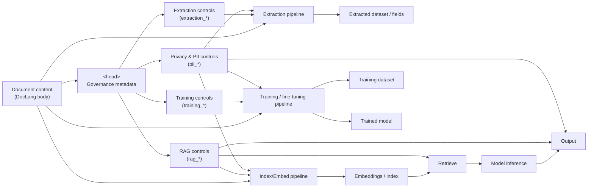

```mermaid
flowchart LR
  D["`Document content<br/>(DocLang body)`"] --> H["#lt;head><br/>Governance metadata"]

  H --> PII["Privacy & PII controls<br/>(pii_*)"]
  H --> EXT["Extraction controls<br/>(extraction_*)"]
  H --> RAG["RAG controls<br/>(rag_*)"]
  H --> TRN["Training controls<br/>(training_*)"]

  D --> X["Extraction pipeline"]
  EXT --> X
  PII --> X
  X --> XD["Extracted dataset / fields"]

  D --> I["Index/Embed pipeline"]
  RAG --> I
  PII --> I
  I --> E["Embeddings / index"]

  E --> Q["Retrieve"]
  RAG --> Q
  Q --> M["Model inference"]
  M --> O["Output"]
  RAG --> O
  PII --> O

  D --> T["Training / fine-tuning pipeline"]
  TRN --> T
  PII --> T
  T --> TD["Training dataset"]
  T --> TM["Trained model"]
```
